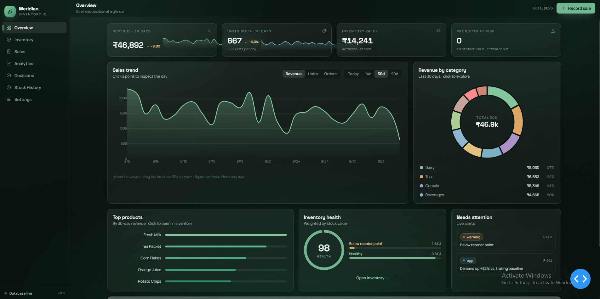
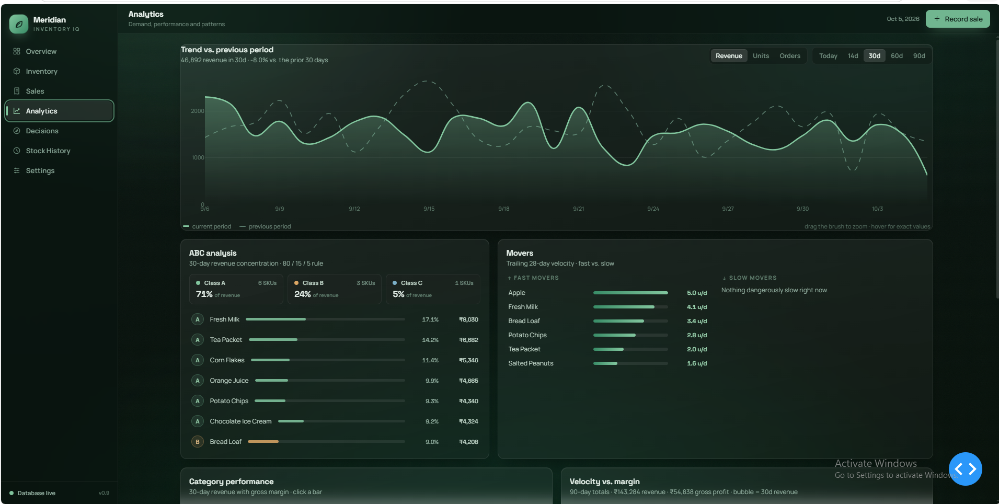
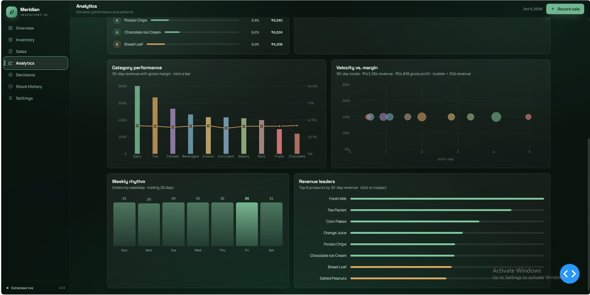
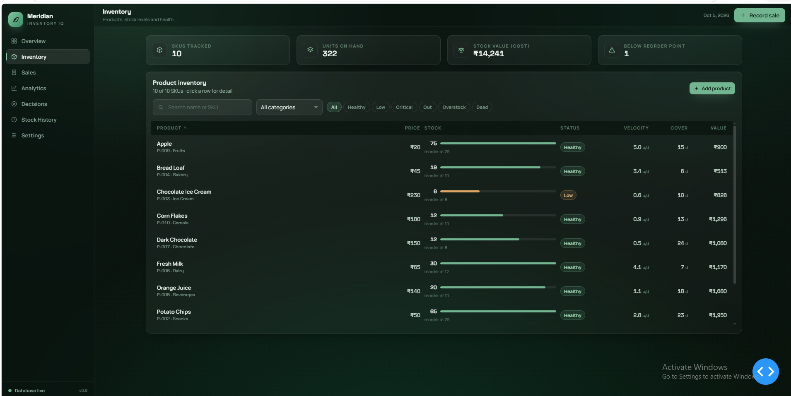
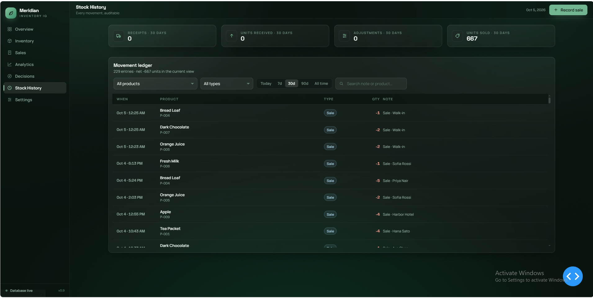
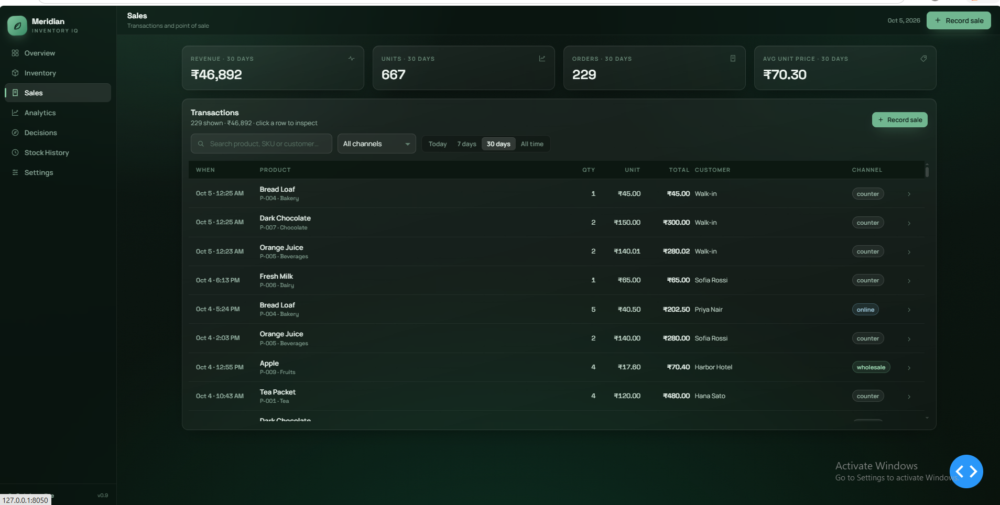
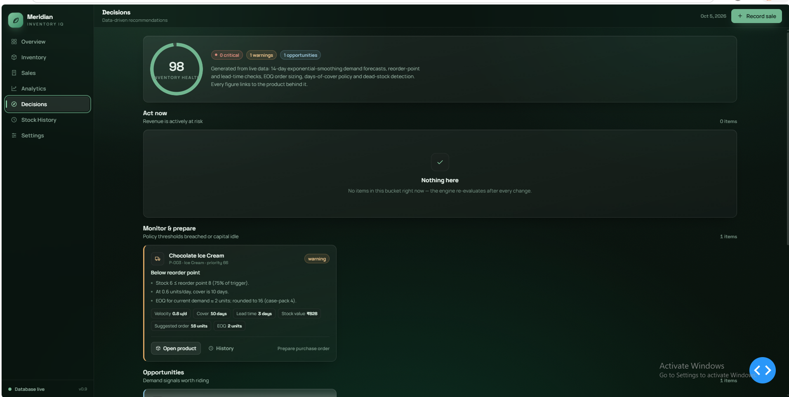
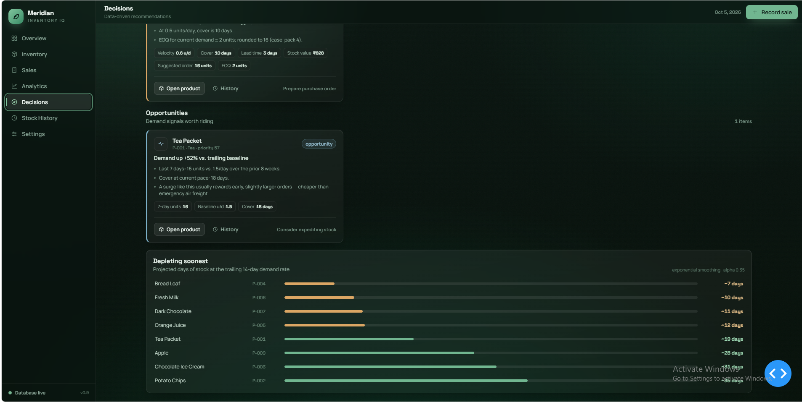
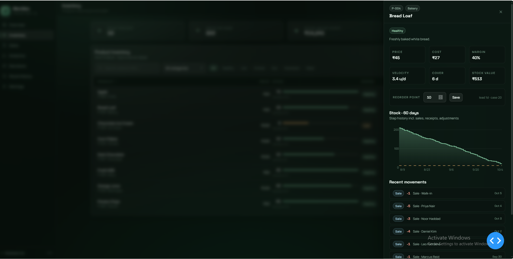

# Meridian Inventory IQ - Inventory Analytics & Decision Support System

## Overview
Meridian Inventory IQ is a comprehensive dashboard designed to provide actionable insights into inventory management, sales velocity, and product performance.

## Core Terminology
- **SKU (Stock Keeping Unit)**: A unique ID code given to each distinct product.
- **UNIT**: A single physical item.
- **ORDER**: A single transaction/checkout.
- **VELOCITY**: The "Speed of Sales". How many units of a product you sell per day on average.
- **COVER (Days of Cover)**: How many days your current stock will last.
- **REORDER POINT**: The safety net limit for stock.
- **VALUE**: Stock Value currently sitting on shelves.
- **REVENUE**: Amount of cash paid for items.

## Analytics & Features

### Analytics
Understand trends, ABC Analysis, and category performances with clear visual indicators.

### Inventory & Stock
Keep an eye on current stock, velocity, and days of cover to ensure you never run out of best sellers.

### Sales Performance
Track sales, weekly rhythms, and revenue easily. 

### Decisions Panel
Get recommendations on when to order based on opportunity (demand surge) and warnings (below reorder point).

### Product Insights
View detailed performance of individual products, categorizing fast and slow movers to adjust your strategy.

